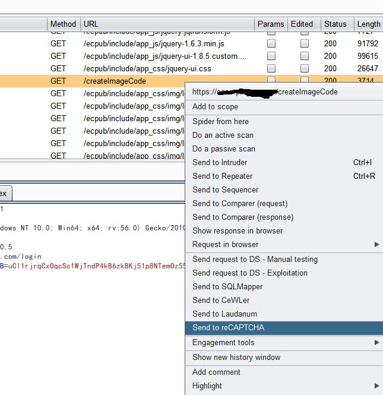

### **reCAPTCHA**

A Burp Suite extender that **<u>auto reconginze CAPTCHA and use for intruder payload</u>**. 

### **usage**

**Install** 

1. download this burp extender from [here](https://github.com/bit4woo/reCAPTCHA/releases).
2. add it to burp suite. you will see a new tab named “reCAPTCHA”, if  no error encountered. 

**prepare**

1. visit your target website(or App) with burp proxy enabled, ensure burp recorded http or https traffic of your target.

2. you need to find the request that get the CAPTCHA image, select it and right click to chose "send to reCAPTCHA".

    

3. switch to reCAPTCHA tab and config the parameters that needed.(http://www.ysdm.net is the only vailiable API currently) you can click the "request" button to test the config.

4. finished the config and test success, now you can use this extender for intruder payload.

**use in Intruder**

two scene:   username or password +CAPTCHA; username +password +CAPTCHA ;

**scene one:** when only password or only username need change , We can use Pitchfork type to use this . as below:

**scene two:** both username and password need change, it's more complex. we  also use Pitchfork type ,but need to mark username and password as one insert point. like this:

and config payload set 1 use "Custom iterator". combine username and password in the "payload options[custom iterator]"

intruder running like below:

### **screenshot**

### **Log**

2017-11-01: first demo release.

2018-07-02: support [GSA Captcha Breaker]

201808-07: support https://www.jsdati.com